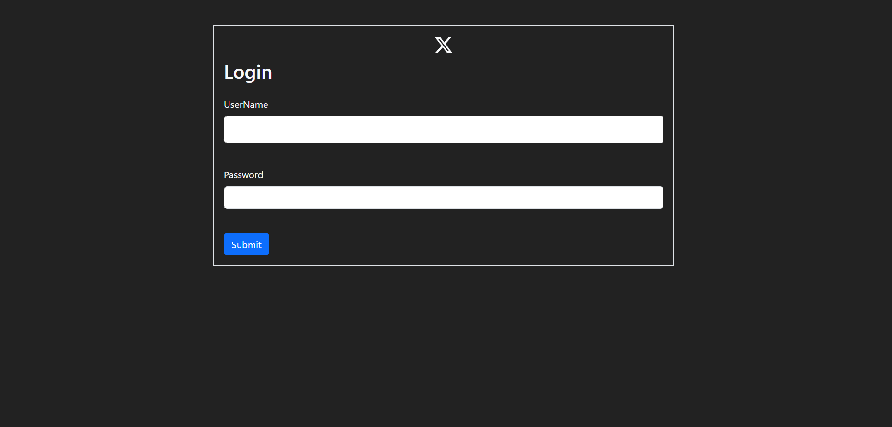
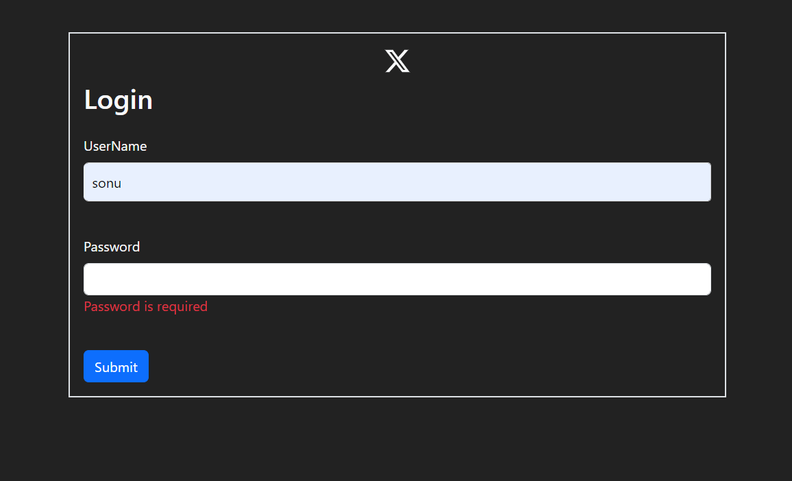
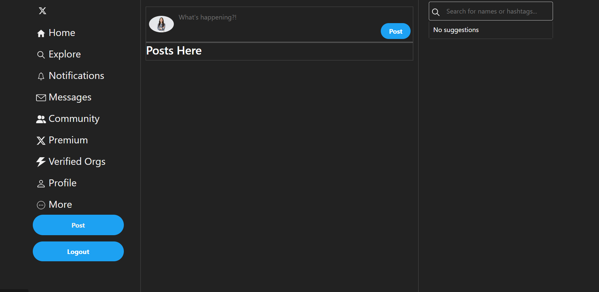
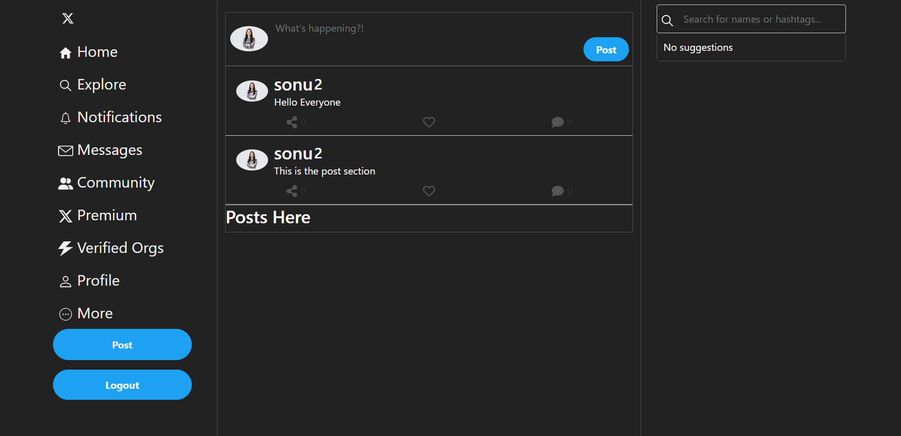
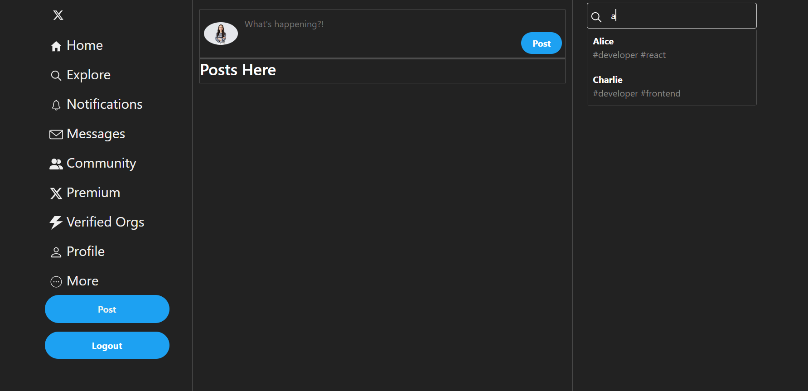
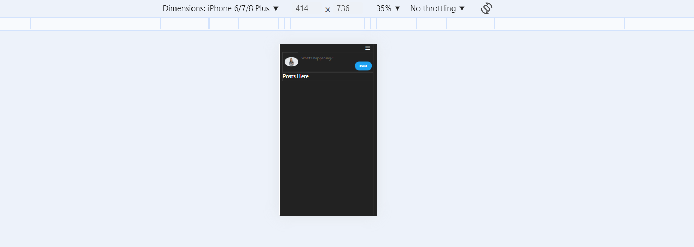
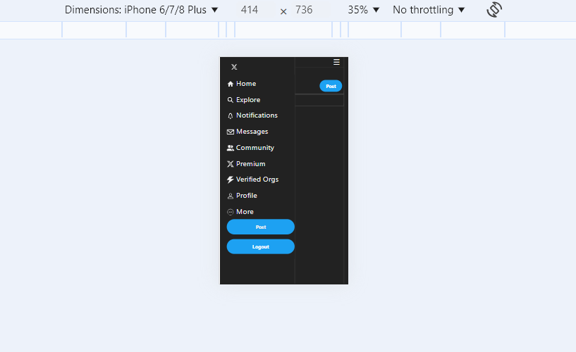
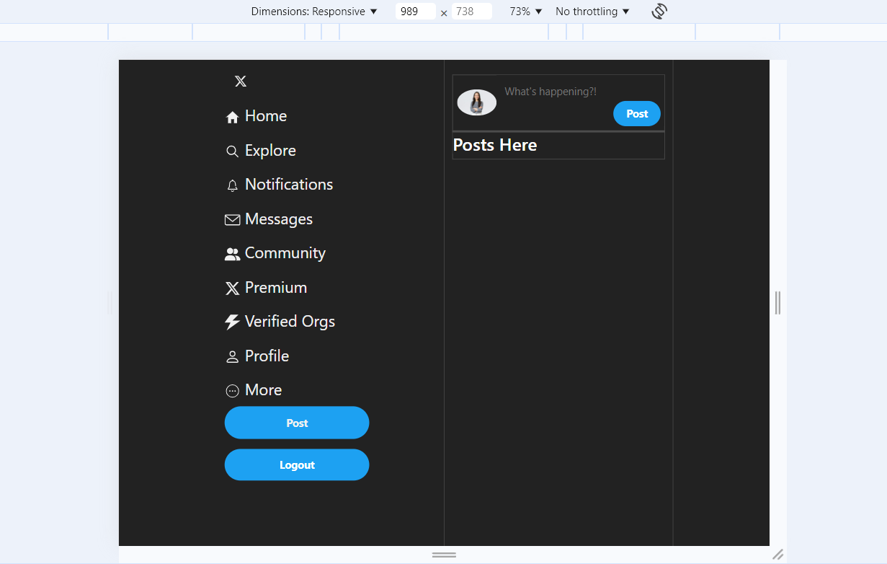
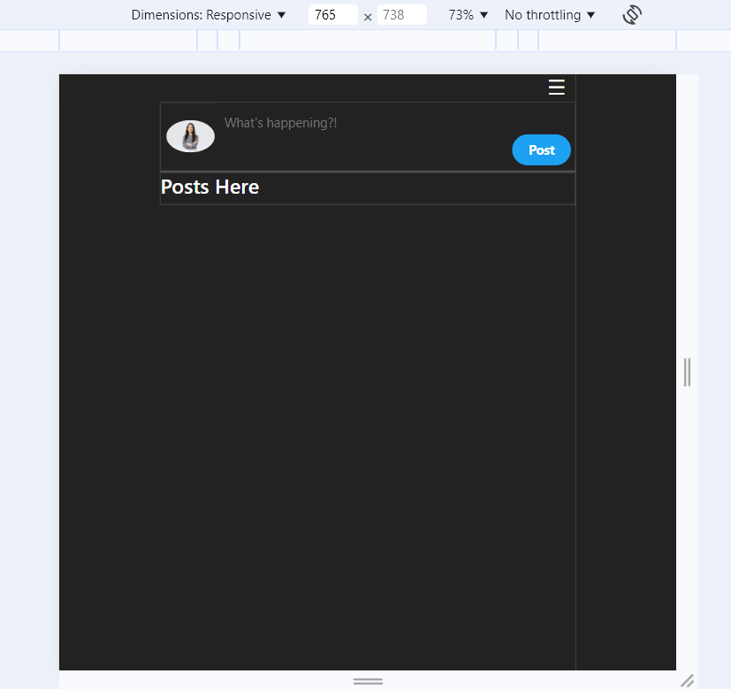

<h1>TwittwerIntegration</h1>
<ol>
  <li>This is a fetched data Integration page</li>
  <li>In this page we can login with a predefined username and passweord from the api</li>
  <li>And we can send a message with post</li>
  <li>we can search a user based on name</li>
  <li>in the post section when posted a comment we can "like", "share", "comment".</li>
  <li>etc...</li>
</ol>

<h3>1.Login interface</h3>

When we are trying to login with out username or password it will shown error like this

<h3>2.Homepage</h3>

When we are successfully loggedin this homepage will be shown

<h3>3.Posts or Tweets</h3>

When we want to send a message or a post with our account it shown like this

<h3>4.Search &v Suggetions</h3>

When we are searching a person or person acount or something in searchbar(search-input) suggetions will shown like this

<h3>5.Responsiveness</h3>

Responsiveness in Mobile view

Toggle menu in mobileview

<h3>6.Layouts</h3>

When we are in below 992px it will shown two column layout like this

when we are in 768px it will show single layout like this

These are the main concepts in this small project. Thankyou...

